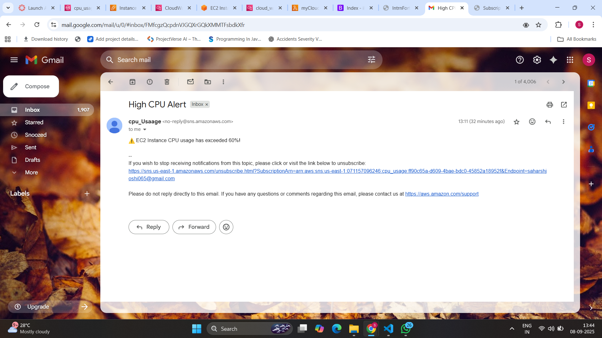

Perfect! For your **Serverless Monitoring App**, you want to capture screenshots that **prove each component is set up and working**. Here’s a clear list:

# 📡 Serverless Monitoring App – AWS Lambda + CloudWatch + SNS

## 👨‍💻 Project Summary

This project implements a **serverless monitoring system** on AWS that:

* Monitors the **CPU utilization** of an EC2 instance using **CloudWatch**
* Triggers a **Lambda function** when CPU usage exceeds 60%
* Sends an **email alert** using **SNS (Simple Notification Service)**

---

## 🧩 Architecture Overview

```
EC2 → CloudWatch Alarm → Lambda Function → SNS Topic → Email Alert
```
## ⚙️ AWS Services Used

| Service    | Purpose                                        |
| ---------- | ---------------------------------------------- |
| EC2        | Instance to monitor                            |
| CloudWatch | Monitors CPU and creates alarm                 |
| Lambda     | Triggered by CloudWatch, sends alert to SNS    |
| SNS        | Sends email notification to subscribed address |
| IAM        | Permissions for Lambda to access SNS           |

---

## 🔐 Permissions and Environment Setup

### ✅ Lambda Environment Variable

| Key             | Value (example)                                         |
| --------------- | ------------------------------------------------------- |
| SNS\_TOPIC\_ARN | `arn:aws:sns:ap-south-1:123456789012:HighCPUAlertTopic` |

### ✅ Lambda Execution Role Permissions

* Must have: `sns:Publish` permission
* For testing, `AmazonSNSFullAccess` was attached

---

## 1️⃣ CloudWatch Alarm Setup

* Go to "CloudWatch → Alarms"
* Select your alarm (e.g., `HighCPUAlarm-EC2`)
* Screenshot should show:

  * Alarm name
  * Metric monitored (`CPUUtilization`)
  * Threshold (`>= 60%`)
  * Actions → Lambda function trigger
* Purpose: Shows the alarm is correctly monitoring CPU and linked to Lambda

---

## 2️⃣ Lambda Environment Variable

* Go to "Lambda → Your Function → Configuration → Environment Variables"
* Screenshot should show:

  * Key: `SNS_TOPIC_ARN`
  * Value: (masked or example ARN)
* Purpose: Shows Lambda can read the SNS topic ARN dynamically

---

## 3️⃣ SNS Topic & Subscription

* Go to SNS → Topics → Your Topic (e.g., HighCPUAlertTopic)
* Screenshot should show:

  * Topic ARN
  * Subscriptions
  * Status = Confirmed
* Purpose: Shows SNS is ready to send email notifications

---

## 4️⃣ **Lambda Function Configuration / Permissions**

* Go to "Lambda → Your Function → Permissions / Execution Role"
* Screenshot should show:

  * Execution role name
  * Attached policy (AmazonSNSFullAccess or custom policy with `sns:Publish`)
* Purpose: Shows Lambda has permissions to publish to SNS

---

## 5️⃣ **Email Alert Received**


* Screenshot the **actual email** you received from SNS

  * Include subject and message text
  * Optionally blur your email address for privacy
* Purpose: Proof that the system works end-to-end

---

## Optional: **Lambda Logs**

* Go to **Lambda → Monitor → Logs**
* Screenshot showing:

  * Lambda invocation
  * Message published to SNS
* Purpose: Demonstrates Lambda executed correctly

---

## 🧪 How to Test

### 1. Simulate High CPU Usage on EC2:

```bash
sudo yum install -y stress
stress --cpu 2 --timeout 300
```

### 2. Wait for CloudWatch Alarm to trigger:

* Alarm moves from `OK` → `ALARM`
* Lambda is invoked
* Email is sent via SNS

---

## 📷 Screenshots (Recommended Order)

Place your screenshots in a `/screenshots` folder. Use the following filenames:

1. `sns-topic.png` – SNS Topic & Subscription
2. `lambda-env-var.png` – Lambda Environment Variable & Permissions
3. `cloudwatch-alarm.png` – CloudWatch Alarm Setup
4. `email-alert.png` – Email Alert Received
5. `lambda-logs.png` (optional) – Lambda execution logs

Example in README:

```markdown


```

---

## 📁 Folder Structure

```
📦 serverless-monitoring-app
┣ 📄 README.md
┣ 📄 lambda_function.py
┣ 📂 screenshots/
┃ ┣ sns-topic.png
┃ ┣ lambda-env-var.png
┃ ┣ cloudwatch-alarm.png
┃ ┣ email-alert.png
┃ ┣ lambda-logs.png (optional)
```

---

