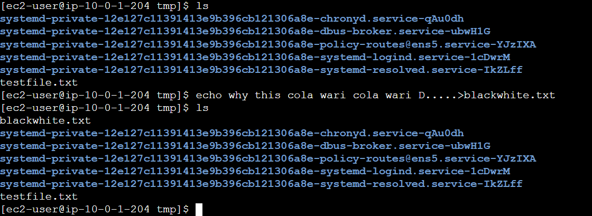
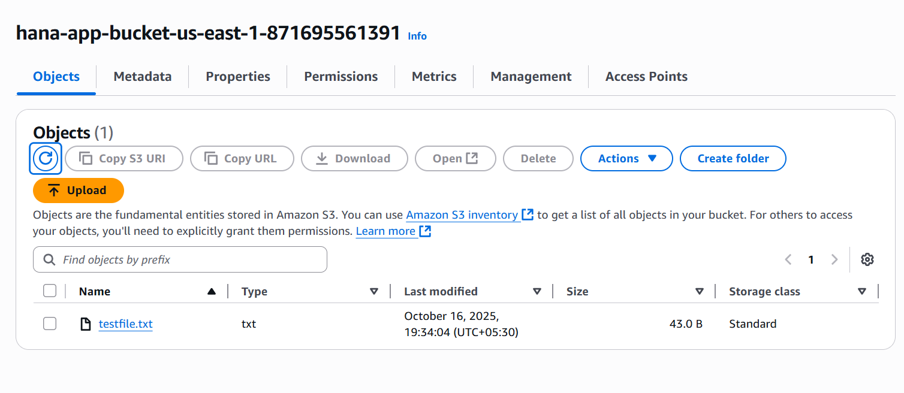

☁️ CloudFormation EC2/S3 Deployment Guide

This document explains the infrastructure defined in test.json and provides the necessary steps to deploy and verify the stack in AWS.

1. Template Overview

The provided file (test.json) is an AWS CloudFormation template written in JSON format. It sets up a basic, secure environment intended for running a simple application and testing S3 access.

Resources Created by this Code

The template creates the following key resources:

Networking (VPC and components): A new VPC with two Public Subnets, an Internet Gateway, and a Public Route Table to ensure the EC2 instance has internet access.

IAM Security:

EC2S3AccessRole: An IAM Role and Instance Profile to grant the EC2 instance secure access to S3.

AdminUser: An IAM User with AdministratorAccess (for management purposes).

Storage:

MyAppBucket: An S3 Bucket for the application data, configured with strict public access blocks.

Compute:

AppInstance: An EC2 Instance launched into one of the Public Subnets, configured with the S3 Access Role.

2. Deployment Steps

Follow these steps to deploy the stack using the AWS Management Console in the us-east-1 region.

Step 2.1: Create a Security Key Pair (Prerequisite)

Before deploying the stack, you must have an EC2 Key Pair in the us-east-1 region for SSH access to the EC2 instance.

Navigate to the EC2 Console in us-east-1.

In the left sidebar, under Network & Security, click Key Pairs.

Click the Create key pair button and name it  ex_key.pem.

Save the private key file ex_key.pem  in a secure location.

Step 2.2: Create the CloudFormation Stack via GUI

Navigate to the CloudFormation Console in us-east-1.

Click Create stack > With new resources (standard).

Under Specify template, select Upload a template file and upload your local test.json file. Click Next.

Specify stack details:

Stack name: Enter a name (e.g., MyAppStack).

Parameters: Enter the required values:

AMIId: Use the default (ami-0bdb828fd58c52235) or provide a known valid AMI for us-east-1(eg. ami-0341d95f75f311023).

KeyName: Enter the name of the Key Pair that you created in Step 2.1 (e.g., ex_key).

Click Next through the options pages.

Review and deploy: On the final review screen, scroll to the bottom. Because your template creates IAM resources, you MUST tick the box under Capabilities that says:

I acknowledge that AWS CloudFormation might create IAM resources with custom names.

Click Submit to start the deployment.

Wait for completion: Monitor the stack events in the AWS console until the status reaches CREATE_COMPLETE.

3. Verification

Inline Markdown (relative file in repo):

Once the stack is complete, verify that the EC2 instance launched and that the test file was successfully uploaded to S3.

Step 3.1: Check EC2 Status

Go to the CloudFormation Console, select your stack (MyAppStack), and click the Outputs tab.

Locate the InstancePublicIp output value to confirm the EC2 instance is running and accessible.

(Optional) Navigate to the EC2 Console to view the instance details.

Inline Markdown (relative file in repo):

Step 3.2: Check S3 File Upload

The EC2 instance's startup script (UserData) should have automatically uploaded a file named testfile.txt to your new S3 bucket.

Go to the CloudFormation Console, select your stack, and click the Outputs tab.

Find the BucketName output value and copy the name (e.g., MyAppStack-app-bucket-us-east-1-123456789012).

Navigate to the S3 Console.

Find and click the bucket with the name you copied.

Look inside the bucket for a file named testfile.txt. If it is present, the EC2 instance successfully launched, assumed its IAM role, and completed the S3 upload!
### Add an image

Inline Markdown (relative file in repo):

Remote image (public URL):

HTML for sizing or S3-hosted images:

Tip: store images under a folder like ./assets or ./docs/images and reference them with a relative path.

If you see this file, the UserData script ran correctly, the IAM role worked, and the file was uploaded!